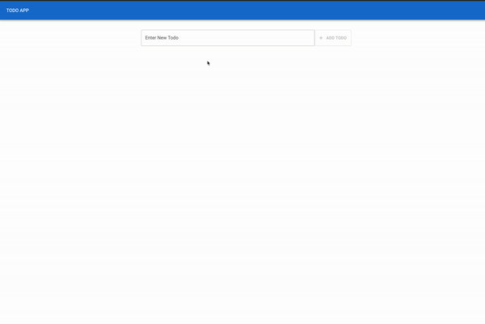

# Todo List App

Frontend Web application built with React that allows you to save, edit, and delete todo tasks. All saved on your local storage so that they persist after refreshing the page.

## Live Link

View live deployment [here](https://cristianordonez.github.io/todo-list-app/) or see the demo below.

## Features & Usage

-   Ability to add, edit and delete todos
-   Todos persist between refreshes on local storage
-   Todo list items appear with strikethrough when marked as completed

## Demo



## Tech Stack

This project was built using Next.js and the following technologies:


## Setup/ Installation

Clone this repository to local machine then navigate to directory in the console.
In the project directory, you can start the development server using the following script:

```bash
npm start
```

Open [http://localhost:3000](http://localhost:3000) to view it in your browser.

The page will reload when you make changes.\

Then run end to end tests to to check functionality:

```bash
npm test
```

If deploying with Github Pages, first create production build:

```bash
npm run predeploy
```

Then complete deployment:

```bash
npm run deploy
```

Make sure that "homepage" key in package.json represents url of your Github Page.

## Resources (include useful or related links)

Deployment was completed using [create-react-app and Github Pages build Environment ](https://create-react-app.dev/docs/deployment/).
